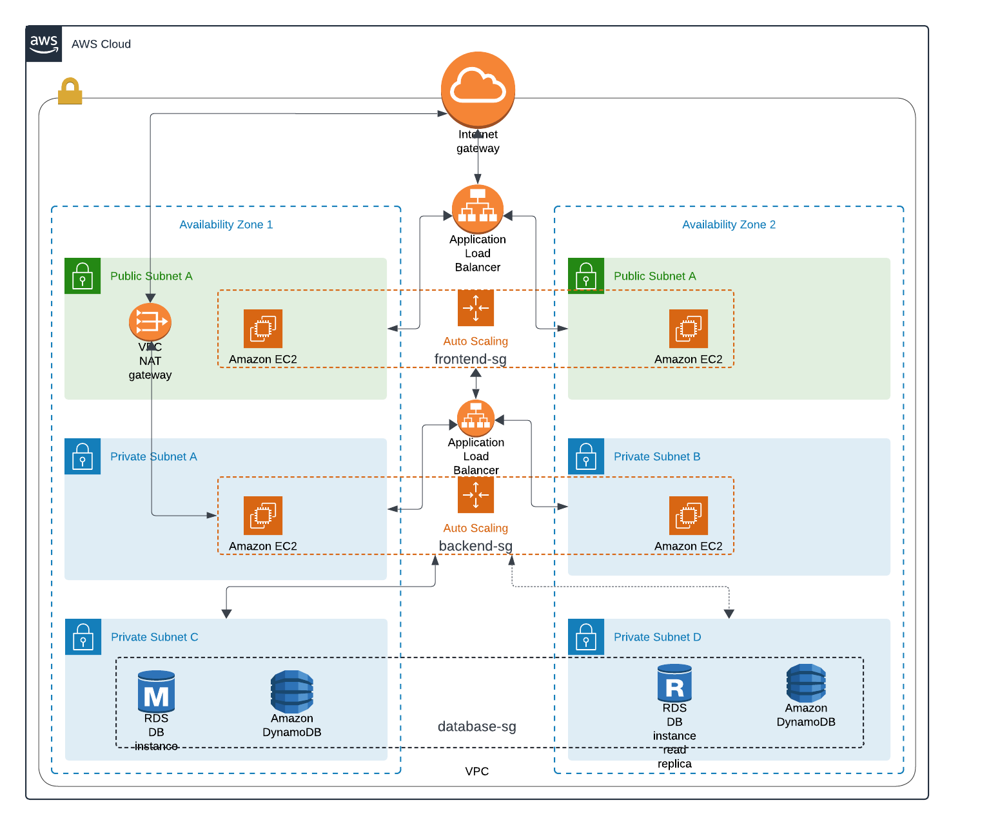

# Arquitectura

---

El diseño de arquteictura tiene como objetivo la alta disponibildiad, escalabilidad y seguridad, distribuyendo los componentes en dos Availibility Zones. A continuación se describen las elecciones principales de esta arquitectura:

## **Amazon EC2 Instances:**

- **Frontend**: Dos instancias de EC2 ubicadas en subredes públicas (una en cada zona de disponibilidad) para manejar el tráfico entrante de los usuarios.

- **Backend**: Dos instancias de EC2 ubicadas en subredes privadas (una en cada zona de disponibilidad) para manejar la lógica de la aplicación y comunicarse con la base de datos.
  

## **Auto Scaling Groups:** 

- **Frontend-sg** y **backend-sg**: Autoescalado para las instancias de frontend y backend, lo que permite ajustar dinámicamente el número de instancias según la carga.
  
 
## **Redes y Seguridad**:

- **Subredes Públicas y Privadas**: Las subredes públicas alojan las instancias frontend y un NAT Gateway, mientras que las subredes privadas alojan las instancias backend y las bases de datos. Esta segregación mejora la seguridad y organiza el tráfico de red de manera eficiente.
- **NAT Gateway**: Situado en una subred pública, el NAT Gateway permite que las instancias en subredes privadas accedan a Internet. (Comunicación con svc externos).
- **Internet Gateway**: Proporciona conectividad entre la VPC y Internet, permitiendo que las instancias en subredes públicas se comuniquen con Internet.
- **Grupos de Seguridad (SG)**: Se crean los SG para control de tráfico (in/out), además de  sumar una capa de seguridad adicional. 
  

## **Bases de Datos:**

- **RDS**: Implementa una configuración de alta disponibilidad con instancias de lectura y escritura distribuidas.

- **Amazon DynamoDB**: NoSQL distribuida.
  