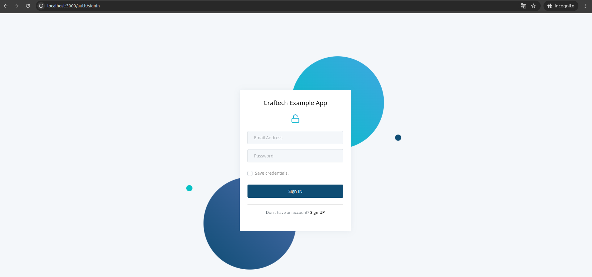
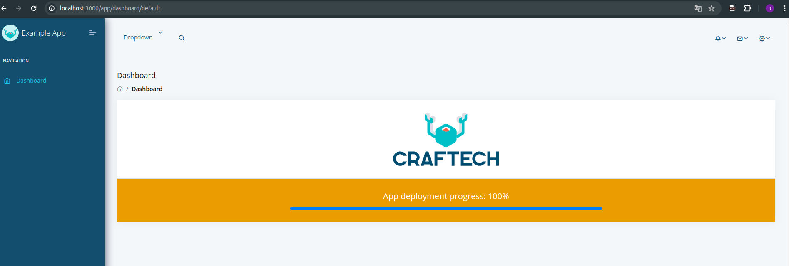

## How to deploy

  
###  Docker

  
> [!NOTE]
> Before deploying, the credentials for our database must be configured in `.env.postgres` file.
>Copy: `cp -a .env.postgres.example .env.postgres` in `.env.postgres`
> Then set the environment variables in our application in **`.env`** file.
>Copy: `cd app-backend && cp -a .env.example .env`
  

```
git clone repo
cd prueba-2/docker/ && docker-compose up -d --build
```
  

> craftech-app-example is now running on [http://localhost:3000](http://locolhost:3000/).

---

### Screenshots

Auth:


App-frontend:
  

 
--- 
### AWS - EKS

> [!NOTE]
>Requirements:
>**EKS(CRD: sealed-secrets), ECR, IAM permissions, Network configuration, RDS Instance**
> (We assume that we already have everything deployed).

### 1. Authenticate in ECR registry:
```
aws ecr get-login-password --region us-west-2 | docker login --username AWS --password-stdin <account-id>.dkr.ecr.us-west-2.amazonaws.com
```

### 2. Create a repository in ECR:
```
aws ecr create-repository --repository-name api
aws ecr create-repository --repository-name react
```

### 3. Tag and push your Docker images:
```
docker tag your-api-image:latest <account-id>.dkr.ecr.us-west-2.amazonaws.com/api:latest
docker push <account-id>.dkr.ecr.us-west-2.amazonaws.com/api:latest

docker tag your-react-image:latest <account-id>.dkr.ecr.us-west-2.amazonaws.com/react:latest
docker push <account-id>.dkr.ecr.us-west-2.amazonaws.com/react:latest
```

### 4. Deploy to EKS
>[!IMPORTANT]
> Previously we must encrypt our secret with [kubeseal](https://github.com/bitnami-labs/sealed-secrets).
```
kubectl apply -f 01-sealed-secret.yaml
kubectl apply -f 02-pvc.yaml
kubectl apply -f 03-backend-deployment.yaml
kubectl apply -f 04-frontend-deployment.yaml
```